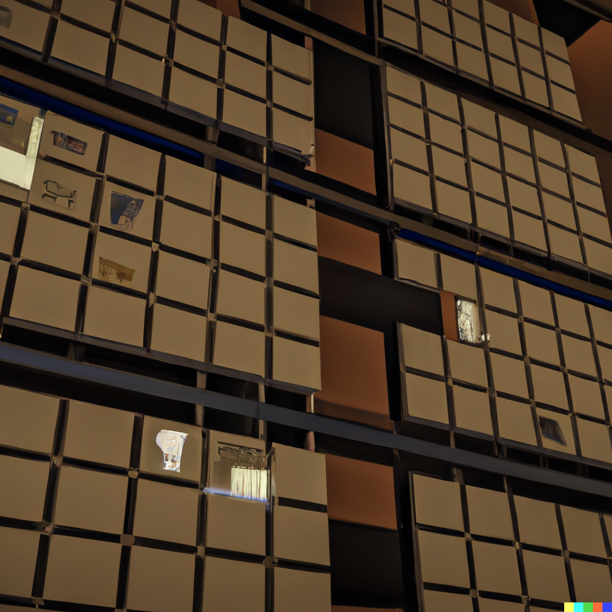

# Test Engineering and Quality Assurance

* [Verification and Validation](./verification_and_validation.md)
* [Objectives of testing](./testing_objectives.md)
* [Why software testing is "inherently" hard](./inherently_hard.md)
* [The 3 axes of software testing](./axes_of_testing.md)  
* [Black, grey, and white box Testing](./black_grey_white_box_testing.md)
* [Cost of bugs](./cost_of_bugs.md)
* [Common definitions](./common_definitions.md)
