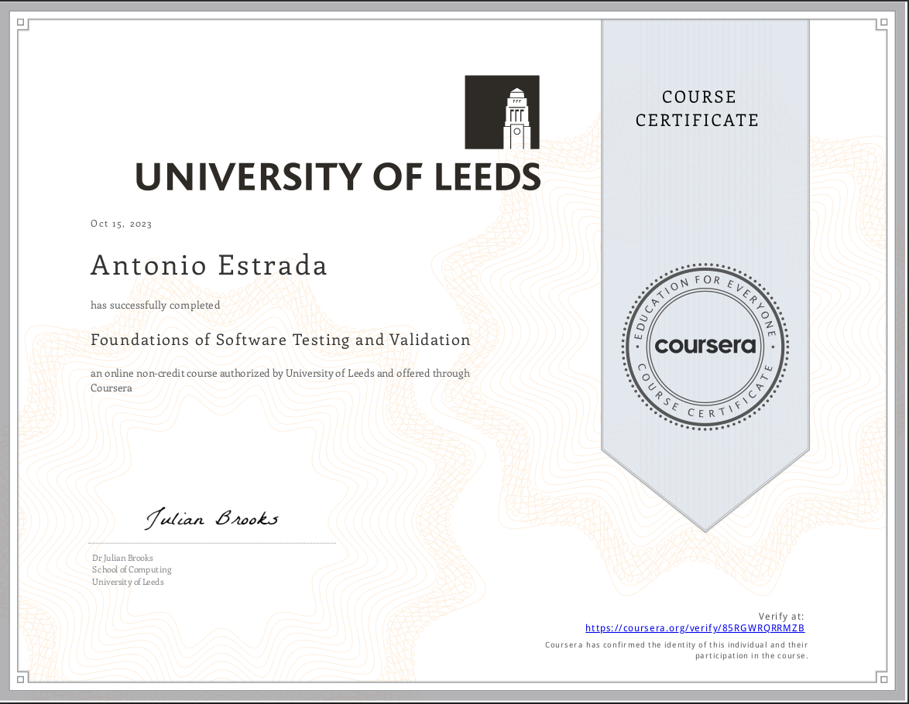

# Test Engineering and Quality Assurance

## Software Testing

**Definition**:
Software testing is the process of evaluating and verifying that a software application or system meets specified requirements and functions correctly. It involves executing a software component or system component to evaluate one or more properties of interest. The main objective of software testing is to identify defects, errors, or other issues that might adversely affect the functionality, performance, or usability of the software.

### Reasons Why We Do Software Testing:

Software testing is fundamental for ensuring the quality and functionality of software applications. Delving deeper into its concepts, we come across several key terms and objectives:

### Key Terms in Software Testing:

1. **Bug**: A flaw in the software code causing it to produce unexpected results or behave in unintended ways.
1. **Error**: A result of human action or decision that leads to an incorrect or unexpected outcome.
1. **Failure**: The software's inability to perform its intended function due to a bug or an error.
1. **Stakeholders**: Individuals or groups involved in the development and production of the software.
1. **End Users**: The actual users who utilize and interact with the software product.

### Primary Goal of Software Testing:

Identify and rectify bugs, errors, and failures to ensure the software application operates as intended and adheres to quality standards.

### Objectives of Software Testing:

1. **Validation**: Confirm that the software application aligns with the requirements and specifications set by stakeholders, including end users.
1. **Verification**: Testing.  Confirm that the software application strictly behaves according to those specifications.
1. **Ensure Quality**: Testing is done as part of supporting the overall quality assurance effort.  Testing ensures that the software meets the quality standards and performs as expected. It helps in verifying that the software functions correctly and meets user requirements.
1. **Identify Defects**: Through testing, defects or bugs in the software can be identified and rectified before the software is released to the end-users.
1. **Reduce Risks**: By identifying issues early in the development process, testing helps in reducing the risks associated with software failures, which can lead to financial losses, reputation damage, or even legal liabilities.
1. **Increase User Satisfaction**: A well-tested software provides a better user experience, leading to increased user satisfaction and trust in the product.
1. **Cost-Efficiency**: Detecting and fixing defects early in the development lifecycle is less expensive than addressing them after the software is in production.
1. **Ensure Compatibility**: Testing ensures that the software is compatible across different devices, browsers, operating systems, and network environments.
1. **Validate Software Performance**: Performance testing ensures that the software operates smoothly under expected loads and doesn't suffer from issues like slow response times or crashes.
1. **Regulatory Compliance**: In certain industries, software must meet specific regulatory standards. Testing ensures that the software complies with these regulations.
1. **Build Confidence**: Testing provides confidence to stakeholders, developers, and users that the software is reliable and can be trusted.
1. **Support Continuous Integration/Continuous Deployment (CI/CD)**: Automated testing supports CI/CD processes, allowing for faster and more frequent releases.

### Additional Resources:

* [Verification, Validation, and QA](./verification_and_validation.md)
* [Objectives of testing](./testing_objectives.md)
* [Software Development Lifecycle](./sdlc.md)
* [Static vs Dynamic Testing](./static_vs_dynamic.md)
* [Black, grey, and white box Testing](./black_grey_white_box_testing.md)
* [Test levels, test types, and the test pyramid](./test_types_pyramid.md)
* [Test design techniques](./test_design_techniques.md)
* [List of Software Testing Techniques and Activities](./test_types_and_categories.md)
* [Principles of software testing](./principles_of_software_testing.md)
* [Dependability](./dependability.md)
* [Why software testing is "inherently" hard](./inherently_hard.md)
* [The 3 axes of software testing](./axes_of_testing.md)
* [Cost of bugs](./cost_of_bugs.md)
* [Test driven development, software testing and development documentation](./tdd.md)
* [Understanding risk based testing](./risk_based_testing.md)
* [Glossary](./glossary.md)
