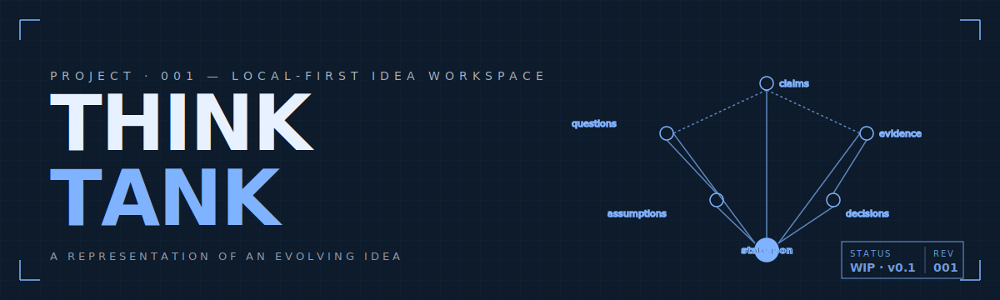
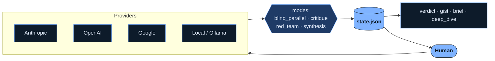

<div align="center">




</div>

# Think Tank

> **Status:** Building — prototype phase.
> This document captures the current thinking and decisions made so far. Major design choices reference companion documents for the full reasoning.

A local-first idea workspace where a human and multiple AI agents develop ideas into durable, searchable, versioned artifacts. The core artifact is not the chat transcript — it's a structured, editable project state: claims, questions, evidence, disagreements, decisions, assumptions, artifacts, and changes over time.


## Contents

| § | Section |
|---|---|
| `01` | [Why this exists](#why-this-exists) |
| `02` | [Thesis](#thesis) |
| `03` | [What it is](#what-it-is) · [What it is NOT](#what-it-is-not) |
| `04` | [Design commitments](#design-commitments) |
| &nbsp;&nbsp;`04.1` | [Use what you already have](#use-what-you-already-have) |
| &nbsp;&nbsp;`04.2` | [Credentials live in the environment](#credentials-live-in-the-environment) |
| &nbsp;&nbsp;`04.3` | [Local-first](#local-first) |
| `05` | [Implementation approach](#implementation-approach) |
| &nbsp;&nbsp;`05.1` | [Stack decisions](#stack-decisions) |
| &nbsp;&nbsp;`05.2` | [Domain model — let it emerge](#domain-model--let-it-emerge) |
| &nbsp;&nbsp;`05.3` | [Prompts as a first-class subsystem](#prompts-as-a-first-class-subsystem) |
| &nbsp;&nbsp;`05.4` | [Rich outputs as a first-class capability](#rich-outputs-as-a-first-class-capability) |
| `06` | [Core abstractions](#core-abstractions) |
| &nbsp;&nbsp;`06.1` | [Project state (`state.json`)](#project-state-statejson) |
| &nbsp;&nbsp;`06.2` | [Modes (not "exchange depth")](#modes-not-exchange-depth) |
| &nbsp;&nbsp;`06.3` | [Hierarchical summaries](#hierarchical-summaries-semantic-zoom-not-compression-ratio) |
| &nbsp;&nbsp;`06.4` | [Inline elaboration / glossary capture](#inline-elaboration--glossary-capture) |
| &nbsp;&nbsp;`06.5` | ["IDE for ideas" — what that actually means](#ide-for-ideas--what-that-actually-means) |
| `07` | [Project layout (provisional)](#project-layout-provisional) |
| `08` | [A day in the life](#a-day-in-the-life) |
| `09` | [Relationship to Deliberation Room](#relationship-to-deliberation-room) |
| `10` | [Build plan](#build-plan) |
| `11` | [Prior art surveyed](#prior-art-surveyed) |
| `12` | [Open questions](#open-questions) |
| `13` | [Risks](#risks) |
| `14` | [Status & next steps](#status--next-steps) |

**Companion documents.** This README is the overview. The deep reasoning lives in dedicated docs in this same directory:

- [`domain-model.md`](./domain-model.md) — what "domain model" means here, candidate nouns and verbs, and the discipline of letting the schema emerge from real use.
- [`prompts.md`](./prompts.md) — the prompt assembly pipeline, role/mode/context layers, prompt management strategies, and why the synthesizer's prompt is the most important piece of the whole product.
- [`stack-decisions.md`](./stack-decisions.md) — provider abstraction (aisuite vs LiteLLM vs LangChain vs roll-your-own), Python-vs-Go for the engine, CLI-first-then-API architecture, and migration paths.
- [`rich-outputs.md`](./rich-outputs.md) — agents producing visualizations, diagrams, charts, and mind maps as first-class outputs alongside text; the artifact subsystem; render targets; and the progression from source-only to interactive UI.


## Why this exists

Working with AI assistants for ideation is genuinely useful, but the workflow has gaps:

- Each tool is its own silo. Conversations live inside one provider's UI.
- Insights vanish into chat history. Hard to find, harder to build on.
- Each new session starts from scratch — agents forget definitions, framings, and decisions already settled.
- "Multi-model" tools mostly do side-by-side comparison, not collaborative development of an idea.
- Browser searches and side conversations break flow when you want to define a term or chase an example.

The bet: the most valuable thing isn't a better chat UI. It's a **representation of an evolving idea that survives across sessions, agents, and providers**.


## Thesis

> [!IMPORTANT]
> Think Tank is a local-first idea workspace where a human and multiple AI agents develop ideas into durable, searchable, versioned artifacts. The core deliverables are the structured project state and the rich visual artifacts that agents produce alongside it — not the chat transcripts that generated them.

This is sharper than "multi-agent chat room for ideation," because the latter risks becoming "LibreChat plus some agent turns." The novel artifacts are the **project structure itself** and the **visualizations agents produce as part of working on it** — diagrams, mind maps, charts, mocks, and structured data that make ideas inspectable, not just readable.


## What it is

A workspace where:

- **Multiple AI agents** can be called in parallel or in turn, from any combination of providers (Anthropic, OpenAI, Google, xAI, OpenRouter, local models via Ollama / LM Studio, etc.).
- The output of those calls feeds into a **structured project state** — not just a transcript.
- That state is **human-editable, versioned, and source-control-friendly**.
- Every agent (including new ones brought into a session later) automatically reads from the same shared project state, so context doesn't have to be re-explained.
- Agents work as **research assistants, not chat partners** — producing diagrams, mind maps, charts, flow charts, structured data, and mocks alongside their textual responses. Visualization is a first-class output, not a side feature.
- Inline **right-click-elaborate** lets you capture definitions, examples, clarifications, and on-the-fly visualizations into the project without breaking the conversation.

## What it is NOT

- Not a real-time chat UI (LibreChat, Open WebUI, MultipleChat already exist).
- Not a model-comparison tool (TypingMind, ChatPlayground exist).
- Not an agent orchestration framework (LangGraph, CrewAI, OpenAI Agents SDK exist).
- Not an autonomous agent swarm — the human stays in the loop and in control.
- Not an extension of [Deliberation Room](#relationship-to-deliberation-room). Sibling, not child.


## Design commitments

Three principles that shape every downstream decision. They emerged from triaging existing tools and finding that most of them fail at least one — often the first.

### Use what you already have

Most tools in this space are middlemen. They sit between you and the provider APIs you're already paying for, take a cut (subscription, data access, or both), and gate access behind their UI choices. Think Tank rejects that pattern.

> [!IMPORTANT]
> **No new middleman.** Think Tank uses the auth method you already have. It auto-detects credentials in your environment. It prefers subscription auth (where the provider permits) over per-token API billing. It never re-sells access to models you already pay for elsewhere.

What this means in practice:

- **Auto-detect on first run.** Scan environment variables (`$ANTHROPIC_API_KEY`, `$OPENAI_API_KEY`, `$GEMINI_API_KEY`, `$XAI_API_KEY`, `$OPENROUTER_API_KEY`, etc.), common config locations (`~/.anthropic/`, `~/.openai/`), and OS keychains. Show the user what was found and ask which to enable. No "paste your key here" prompt as the default path.
- **Subscription wins by default.** When a provider supports both subscription tokens (e.g. via `claude setup-token`) and API keys, the subscription path is preferred — it's free at the margin for users who already pay for it. Per-call override is trivial (`tt --auth=apikey ask ...`).
- **No silent escalation.** If a subscription token rate-limits or expires, the tool asks before falling back to API key billing. People budget very differently for "$200 flat" vs "pay per token"; surprise per-token charges are the most common complaint about every tool in this space.
- **Per-provider auth list with fallback.** Each provider has an ordered list of supported methods: subscription token → direct API key → aggregator key (OpenRouter, etc.). The tool stays neutral about which the user picks; ToS posture per provider is documented so the user can choose with eyes open.

> [!NOTE]
> **Anthropic-specific caveat.** Anthropic's official position is that subscription OAuth is intended for Claude Code and Claude.ai, not third-party tools. The `claude setup-token` path technically works but sits in a gray zone per the consumer ToS. For purely personal use on your own subscription the practical risk is low (a temporary flag at worst). For productized use, this becomes API-keys-only. Treat any subscription auth path as potentially temporary and architect for graceful fallback.

### Credentials live in the environment

The lazy default in most tools is to prompt for an API key on first run, store it in tool-specific config, and move on. That creates secret sprawl: the same key duplicated across five tools in five different formats, eventually committed by accident.

> [!IMPORTANT]
> **One source of truth for credentials.** Secrets live in a user-managed location outside any repo. The tool reads from the environment. Setup guidance teaches the pattern; it doesn't bypass it.

Three-layer model:

| Layer | Purpose | Lifetime |
|---|---|---|
| `~/.secrets/` *(configurable, sourced via shell rc)* | API keys and subscription tokens | Long-lived, rotated on schedule |
| `~/.config/thinktank/config.toml` | Tool preferences (default models, secrets directory, modes) | Per-user |
| `~/thinktank/<project>/` | Project state, transcripts, artifacts, notes | Per-project, git-tracked |

Each layer has clear rules. **Secrets never appear in tool config or project files. Project files never contain credentials. Tool config never contains secrets, only paths and preferences.**

#### First-run setup teaches the pattern

If no credentials are detected, the tool guides the user toward the right pattern instead of offering a "paste your key here" shortcut:

```text
$ tt setup
No provider credentials detected.

Think Tank reads keys from your environment. The recommended setup
is to keep keys in a single location outside any repo, sourced from
your shell rc, so every CLI you install picks them up automatically.

Where would you like to store them? [~/.secrets]
> ~/.dotfiles/.secrets

Created ~/.dotfiles/.secrets (chmod 700)

Add a credential file for which provider?
  1) Anthropic    2) OpenAI    3) Google    4) xAI
  5) OpenRouter   6) Mistral   7) Done

> 1
Paste your Anthropic API key (input hidden):
> ********************************
Wrote ~/.dotfiles/.secrets/anthropic (chmod 600)

To use these keys, source them from your shell rc:
  for f in ~/.dotfiles/.secrets/*; do source "$f"; done

Saved preferences to ~/.config/thinktank/config.toml.
```

Design choices that fall out of this:

- **`--dir` is configurable.** Default is `~/.secrets/`, but users with their own conventions (`~/.dotfiles/.secrets/`, `/opt/local/secrets/`, etc.) can override on first setup or any subsequent run. The choice is remembered in `~/.config/thinktank/config.toml` so subsequent commands don't need it again.
- **Validation, not paternalism.** The tool refuses to write secrets inside any directory containing a `.git/`. It checks directory permissions and offers to fix `700`/`600` if loose. `--no-validate` bypasses for users with unusual setups.
- **Migration is supported.** `tt setup --dir <new-path> --migrate` moves existing files (preserving permissions), updates config, and reminds the user to update shell rc. Reorganizing dotfiles shouldn't break the tool.
- **No tool-local key storage fallback.** Once that escape hatch exists, it becomes the path of least resistance and the pedagogy collapses. The tool only supports env-var-based auth. Users with truly unusual needs can write a wrapper.

### Local-first

Everything lives on your machine. State, transcripts, artifacts — all in `~/thinktank/<project>/`. Git is the version control layer. No cloud sync, no server-side state, no account, no telemetry.

This isn't an aesthetic preference — it's the consequence of the no-new-middleman commitment. A cloud-hosted Think Tank would have the same data-pipe problem the tool was built to avoid.


## Implementation approach

Three decisions that shape how the system gets built. Each is summarized here; the full reasoning is in the linked companion documents.

### Stack decisions

> [!IMPORTANT]
> **Python engine, aisuite for provider abstraction, CLI first, FastAPI later.** The engine knows nothing about UI. The CLI is a thin adapter. When a UI eventually exists, it talks to the same engine through HTTP.

- **Python over Go for the engine.** The LLM ecosystem is overwhelmingly Python-first — provider SDKs, abstraction libraries, examples, and community fixes all assume Python. Go's concurrency advantage doesn't earn its keep here because the workload is I/O-bound (waiting on remote APIs), not CPU-bound. `asyncio.gather` over `httpx` coroutines handles parallel fanout cleanly. Go remains an option for specific later components (a long-running indexer, a system-service daemon) that would talk to the Python engine over IPC.
- **[aisuite](https://github.com/andrewyng/aisuite) over LiteLLM, LangChain, or roll-your-own.** aisuite is a thin wrapper around official provider SDKs — no daemon, no proxy, no separate process. The `provider:model` string identifier maps cleanly to what `state.json` needs to record about each turn. LiteLLM is over-engineered for a personal tool; LangChain hides the data flow we want to see; rolling our own re-creates the work aisuite already finished.
- **CLI first, then HTTP API.** The engine functions return data, never print, and never read environment without an explicit config object. The CLI (`typer` or `click`) is a thin argv-to-engine-call adapter. Adding FastAPI later is ~100 lines because the engine's surface is already shaped for it. Future UIs in any language talk to the API.

> [!NOTE]
> The full analysis — including why aisuite specifically, how Go's concurrency model would actually play here, and the migration paths between options — is in [`stack-decisions.md`](./stack-decisions.md).

### Domain model — let it emerge

> [!IMPORTANT]
> **Don't commit to a domain model before two weeks of real use.** The candidate nouns (`claim`, `question`, `agent`, `mode`, `glossary_entry`) and verbs (`ask`, `elaborate`, `synthesize`, `supersede`) all *look* obvious until you try to use them on real problems and discover edge cases that warp the abstraction.

The first prototype represents state as plain Python dicts read from and written to `state.json`. No Pydantic models, no SQLAlchemy schemas, no typed dataclass hierarchies. When the same dict-massaging code shows up in three places, *that's* the signal to extract an abstraction. Premature abstraction is what "committing to a domain model too early" means in practice.

Examples of questions only real use can answer:

- Is `claim` one thing, or three? Is "I think X because Y" one claim with embedded reasoning, or a claim plus a supporting argument?
- Is `glossary_entry` separate from `claim`, or just a `claim` with `type: "definition"`?
- Is `agent` something the user creates and persists ("I have an agent named 'skeptic'"), or just a runtime label ("this turn used Claude with the skeptic prompt")?
- Is `mode` a property of an agent, of a turn, or of a session?
- Does `transcript` need internal structure, or is it dumb append-only audit log?

> [!NOTE]
> See [`domain-model.md`](./domain-model.md) for the full reasoning, the candidate vocabulary, and the discipline for letting the right abstractions emerge from places where the code is fighting you.

### Prompts as a first-class subsystem

> [!IMPORTANT]
> **The product is, mechanically, a system for sending prompts to LLMs and processing their output.** Prompts get versioned, composed, and managed like first-class artifacts — not buried as inline strings forever.

Every model call is a composition of layers:

```
[base system prompt — what Think Tank is, how to behave]
[role prompt — skeptic / researcher / synthesizer]
[mode prompt — critique / blind_parallel / red_team]
[project context — current state.json or a summary]
[conversation context — what happened earlier this session]
[user turn — the actual question or instruction]
```

Prompt management evolves through three stages, each only adopted when the previous one is fighting back:

1. **Hardcoded in `prompts.py`** — right starting point. Easy to read, grep, and change.
2. **Files in `~/.config/thinktank/prompts/`** — `roles/skeptic.md`, `modes/critique.md`. Edit prompts without touching code; per-project overrides become possible.
3. **Prompts as part of project state** — versioning prompt changes alongside the project they belong to. Defer until the case is proven.

The synthesizer's prompt is the single most important piece of text in the whole product, because it's the only agent whose output mutates durable state. Synthesizer quality dominates user-perceived quality.

> [!NOTE]
> See [`prompts.md`](./prompts.md) for the full pipeline, the multiple kinds of "user turns" (human-asked, synthesizer-fed, glossary-trigger, state-mutation-request), provider-specific prompt quirks, and why agents probably start as config dicts rather than persistent objects.

### Rich outputs as a first-class capability

> [!IMPORTANT]
> **Agents are research assistants, not chat partners.** They produce visualizations — Mermaid diagrams, mind maps, charts, flow charts, structured data, and mocks — as primary outputs alongside text. The artifact subsystem is a first-class engine concern, not a folder of side effects.

A lot of ideation is text — like the conversations that produced this README. But a lot of it isn't. Some ideas only become legible when you can *see* them: the supersession history of a claim as a graph, the project's open questions as a mind map, an architectural sketch as a diagram. Those visualizations are not summaries of the work — they are the work, captured in a form that text can't carry.

What this means structurally:

- **The artifact subsystem is real.** Artifacts have IDs, types, generators, and links back to the concepts in `state.json` they represent. A claim *has* an associated visualization; a glossary entry *has* a diagram; the project's claim-supersession graph is regenerated when state changes.
- **Engine produces sources, consumers render.** Agents output Mermaid text, SVG markup, GraphViz DOT, structured chart data — not pre-rendered images. The CLI shows a path or opens the source; an HTML render bundle (the natural intermediate before a real UI) renders inline; a future UI renders interactively. Same artifact, multiple render paths.
- **Artifact generation is its own role.** Adding "produce visualizations" to the synthesizer's already-overloaded role would push quality down across the board. Artifact generation is a separate pass with its own prompt, its own model preferences, and its own validation step.
- **Provider/model selection matters more.** Different models have very different competence at producing usable rich outputs. Some emit clean Mermaid; some hallucinate it. The artifact registry tracks which providers are good at which artifact types.

This shifts how the build progresses: rich outputs aren't a Layer 3 nice-to-have — they're a Layer 2.5 capability, added as soon as the text-only loop has earned its keep but before any UI work begins. The intermediate "HTML render bundle" output gets you visualization viewing without committing to a frontend stack, and gives you the data to decide whether interactive UI is worth building.

> [!NOTE]
> See [`rich-outputs.md`](./rich-outputs.md) for the artifact subsystem in detail: artifact types, the type registry, why artifact generation is a separate role, provider competence per output type, the HTML render bundle, and how artifacts relate to structured state.


## Core abstractions



### Project state (`state.json`)

The durable artifact. A structured representation of the evolving idea. Provisional sketch:

```json
{
  "project": {
    "name": "Think Tank",
    "one_sentence_description": "",
    "current_thesis": "",
    "status": "exploring"
  },
  "claims": [
    {
      "id": "claim_001",
      "text": "",
      "status": "active",
      "confidence": "medium",
      "supporting_evidence": [],
      "objections": [],
      "supersedes": [],
      "superseded_by": null,
      "created_at": "",
      "updated_at": ""
    }
  ],
  "questions": [],
  "assumptions": [],
  "decisions": [],
  "disagreements": [],
  "evidence": [],
  "glossary": [],
  "artifacts": [],
  "next_actions": [],
  "change_log": []
}
```

> [!WARNING]
> The schema is intentionally provisional. **Don't design it up front.** Let it emerge from real use — premature schemas collect empty fields you dutifully fill in instead of the fields you actually needed.

> [!NOTE]
> **Human-readability is a real concern.** If `state.json` becomes the canonical artifact too early, the project folder may feel alien — you'd be reading raw JSON to understand your own thinking. One option (deferred to Layer 3): treat `state.json` as canonical but always render a `state.md` alongside it as a read-only human view, regenerated on every change. Or skip canonical state entirely for the prototype and let it emerge from `notes/` and `transcripts/`. See [Open questions](#open-questions).

### Modes (not "exchange depth")

Instead of "have agents talk for N turns," interactions happen in named modes:

| Mode | Behavior |
|---|---|
| `blind_parallel` | same prompt to multiple agents, no cross-talk, synthesized after |
| `critique` | one agent's output reviewed by another |
| `red_team` | adversarial pass against a position |
| `research_review` | evidence-gathering pass |
| `synthesis` | collapse multi-agent output into one consolidated view |
| `debate_optional` | sequential cross-talk, used sparingly |

The default is **parallel-then-synthesize**. Sequential debate is a tool used deliberately, not a primary loop. Sequential model-to-model debate tends to converge, repeat, or hallucinate unless agents have meaningfully different roles, tools, or evidence.

### Hierarchical summaries (semantic zoom, not compression ratio)

| File | Purpose |
|---|---|
| `verdict.md` | one line |
| `gist.md` | short human overview |
| `brief.md` | structured summary with major reasoning |
| `deep_dive.md` | detailed synthesis |
| `transcript.jsonl` | complete raw exchange |
| `state.json` | canonical structured project state |

A reader picks a level based on the *kind* of overview they need, not how much patience they have.

### Inline elaboration / glossary capture

Select text in the conversation, pick a verb from a context menu, get an answer captured into the right slice of state.

| Verb | What it does | Lands in |
|---|---|---|
| `define` | "What does this mean?" | glossary |
| `concretize` | "Real-world examples?" | glossary |
| `simplify` | "Plain-English version?" | glossary |
| `deepen` | "Go further on this." | notes |
| `compare-to` | "How does this differ from X?" | claims |
| `cite` / `source` | "Where does this come from?" | evidence |
| `steelman` | "Best version of this argument?" | claims-to-verify |
| `critique` | "Strongest objection?" | claims-to-verify |
| `branch` | "Related concepts worth exploring?" | open questions |
| `visualize` | "Show me this as a diagram / chart / mind map." | artifacts (linked to source concept) |

The verb determines both the prompt to the sub-agent and the destination in state. Same UI gesture, different bucket. Solves the "I keep stopping to ask what something means" problem and builds a personal knowledge graph as a side effect of normal use.

CLI fallback for prototyping (no UI required to validate the workflow):

```bash
tt elaborate "exchange depth" --as=define --context="<paste surrounding text>"
```

### "IDE for ideas" — what that actually means

Not "chat with projects." The metaphor only delivers if it implements the idea-equivalents of what makes IDEs useful:

| Code IDE feature | Think Tank equivalent |
|---|---|
| Jump to definition | Jump to original claim / source / decision |
| Find references | Where else did I discuss this? |
| Refactor | Rename/reframe a concept across the project |
| Type-checking | Check claim consistency |
| Linting | Detect stale, unsupported, vague, contradictory claims |
| Git diff | Show how my position changed over time |
| Dependency graph | Show claims, evidence, assumptions, objections |
| Tests | Validate claims against sources or examples |

These are graph operations, not chat features. The chat is one input surface; the graph is the product.


## Project layout (provisional)

```
~/thinktank/<project>/
  notes/             # markdown notes, human and agent
  transcripts/       # JSONL of every model call
  artifacts/         # rich outputs — diagrams, charts, mocks, structured data
    diagrams/        # Mermaid sources (.mmd)
    charts/          # chart specs (Vega-Lite, chart.js JSON)
    mindmaps/        # Mermaid mindmap or markmap sources
    flows/           # GraphViz DOT, Mermaid flowcharts
    mocks/           # SVG, HTML mocks
    data/            # CSV, JSON datasets agents produce or use
  state.json         # canonical structured project state
  verdict.md
  gist.md
  brief.md
  deep_dive.md
  render.html        # generated render bundle — view artifacts inline
  .git/
```

Per-project sandbox: agents read/write freely **inside** the project folder, never outside. Artifact subdirectories are stable so agents always know where to put a given output type, and the eventual render layer always knows where to find them.


## A day in the life

The clearest way to picture Think Tank is to walk through a session. The example below is fictional — it shows what *would* happen if the prototype existed today and you used it on this very project.

### Day 1 — first prompt

```bash
tt new think-tank --description "A local-first idea workspace where humans and agents develop ideas into versioned artifacts."
tt agent add skeptic --model claude-opus-4-7
tt agent add researcher --model gpt-5
tt agent add synthesizer --model gemini-3
tt ask "Is Think Tank worth building?"
```

After the command finishes, the project folder looks like:

```
~/thinktank/think-tank/
  state.json
  verdict.md           # "Possibly. Validate the workflow before the architecture."
  gist.md              # 2–3 paragraph human overview
  brief.md             # structured summary with disagreements surfaced
  deep_dive.md         # full synthesis of all three agents
  render.html          # browse claims, glossary, artifacts in one place
  transcripts/
    2026-04-25T0930.jsonl    # raw responses from all three agents
  notes/
  artifacts/
    diagrams/
      claim-supersession.mmd  # Mermaid graph of how claims relate so far
    mindmaps/
    charts/
    flows/
    mocks/
    data/
  .git/                # initial commit
```

Open `verdict.md` and you see one line. Open `gist.md` and you see the human overview. Open `state.json` and you see the structured representation: candidate claims, open questions, where the agents disagreed, which mode produced each piece, and which artifacts represent which concepts. Open `render.html` and you see all of it laid out together — claims with their associated diagrams rendered inline.

### Day 3 — pushback on a claim

A couple of days later, you've spent some time using MultipleChat for real ideation. Side-by-side comparison turned out to be more useful than the original framing assumed. You run:

```bash
tt ask "Update: I tried MultipleChat for two days. Side-by-side comparison was actually useful — keeping multiple drafts visible helped me see disagreements I'd otherwise miss. Reconsider the 'not a model comparison tool' anti-goal."
```

The agents respond, the synthesizer revises state, and `git diff state.json` shows:

```diff
- {
-   "id": "claim_003",
-   "text": "Side-by-side model comparison is incidental, not the point.",
-   "status": "active",
-   "confidence": "high"
- }
+ {
+   "id": "claim_003",
+   "text": "Side-by-side model comparison is incidental, not the point.",
+   "status": "superseded",
+   "confidence": "high",
+   "superseded_by": "claim_007"
+ }
+ {
+   "id": "claim_007",
+   "text": "Visible parallel responses are useful when the user is comparing model framings, not just merging into a single answer.",
+   "status": "active",
+   "confidence": "medium",
+   "supersedes": ["claim_003"],
+   "supporting_evidence": ["notes/2026-04-27-multiplechat-trial.md"]
+ }
```

That's the durable record. Two weeks from now, you can answer "why did I change my mind on this?" by reading the supersession chain — not by scrolling through chats.

### Day 5 — agents produce a visualization

The project's getting complex enough that you want to see how the claims relate. You ask:

```bash
tt visualize --of claims --as mindmap --focus "design commitments"
```

The artifact-generation pass routes to whichever model the registry says is best at Mermaid mindmaps. It returns a source file the engine validates (does it parse as Mermaid?), then writes:

```
artifacts/mindmaps/design-commitments.mmd
```

The engine also updates `state.json` to link the artifact to the claims it represents:

```diff
+ "artifacts": [
+   {
+     "id": "art_004",
+     "type": "mindmap",
+     "format": "mermaid",
+     "path": "artifacts/mindmaps/design-commitments.mmd",
+     "represents": ["claim_001", "claim_002", "claim_007", "claim_011"],
+     "generated_by": "anthropic:claude-opus-4-7",
+     "generated_at": "2026-04-29T1542",
+     "stale": false
+   }
+ ]
```

You open `render.html` in your browser. The mindmap is rendered inline, and the claims it visualizes are linked. You see a structural relationship that wasn't obvious in the prose. You make a note that one branch of the mindmap is suspiciously empty — that's an open question you didn't realize you had.

When `claim_007` later gets superseded, the engine marks `art_004` as `stale: true` because it's tied to a now-outdated state. You can ask for a regenerated visualization with one command.

### Day 10 — inline elaboration captures a term

Mid-conversation, an agent uses the phrase "semantic zoom." You half-know what they mean. Instead of breaking flow to ask, you select the phrase and run:

```bash
tt elaborate "semantic zoom" --as=define
```

A glossary entry appears in `state.json` (and any rendered view alongside it):

```json
{
  "id": "term_014",
  "term": "semantic zoom",
  "definition": "A summarization model where each level captures a different kind of information (verdict, gist, reasoning, full detail) rather than a different compression ratio. Contrasts with percentage-based summaries.",
  "captured_from": "transcripts/2026-05-04T1402.jsonl#L23",
  "captured_at": "2026-05-04T14:09:00Z",
  "status": "captured"
}
```

You keep going. Later, `tt review` surfaces the term in a weekly digest so it doesn't sit unread in a graveyard.

### What you can answer two weeks later

| Question | How |
|---|---|
| "How has my view of X changed?" | `git log -p state.json` filtered by claim id |
| "Where did I first say Y?" | grep across `transcripts/` |
| "What did I decide about Z?" | `decisions[]` in `state.json` |
| "Which claims am I least confident in?" | query `state.json` by `confidence` |
| "What questions are still open?" | `questions[]` in `state.json` |
| "Which terms did I never come back to?" | `tt review --stale` |
| "What does this project look like as a whole?" | open `render.html` — claims, glossary, and artifacts in one view |
| "Which visualizations are out of date?" | query `artifacts[]` by `stale: true` |
| "Show me the supersession history" | `tt visualize --of claims --as graph` |

The product is the answer to those questions, not the chat that produced them.


## Relationship to Deliberation Room

Think Tank and [Deliberation Room](https://github.com/ajeless/deliberation-room) are siblings, not parent and child. Different anti-goals, different cadence, different defaults.

**Deliberation Room** is *disciplined deliberation* — round-based, blind responses, structured to fight groupthink. Explicit anti-goals against real-time chat, model comparison, and autonomous swarms.

**Think Tank** is an *evolving idea workspace* — looser cadence, on-demand agent calls, multiple modes (some of which DR explicitly rules out).

What's worth cannibalizing from DR:

- Provider abstraction
- Three-layer memory model (transcript / working summary / structured state)
- JSONL persistence and append-only event log
- Human-override-tracking on structured state
- Checkpoint discipline (versioned state revisions, diff, rollback)

What's not portable:

- The human-seeded round protocol (too rigid for solo ideation)
- Blind-by-default within rounds (sometimes you want a critique pass)
- The room/participant cadence model

The repo is still useful. Fork the concepts, not the product.


## Build plan

Three layers, in order. The decision to build is made; what remains is the discipline of building in the right order so the schema and abstractions emerge from real use rather than guesswork.

### Layer 1 — Spike on what already exists *(triaged)*

Originally framed as "test existing tools first." After partial evaluation, this layer collapsed: most candidate tools (MultipleChat, TypingMind, Poe, AnythingLLM cloud, ChatPlayground) fail the [no-new-middleman commitment](#use-what-you-already-have) by design — subscription-gated, route through their backends, ask for payment for access already covered by existing subscriptions. That's a structural mismatch with Think Tank's positioning, not a UX problem to learn from.

> [!NOTE]
> Two self-hostable, BYOK alternatives remain worth a one-evening spike each, just to confirm they don't already cover the project-state-and-versioning gap: [Open WebUI](https://github.com/open-webui/open-webui) and [LibreChat](https://github.com/danny-avila/LibreChat). Either could plausibly host the workflow as a notes folder + git, but neither is built around structured state as the durable artifact. Quick verification, not extended evaluation.

### Layer 2 — Weekend prototype

Smallest possible local prototype. ~200 lines of Python plus aisuite. No UI, no framework, no sandboxing, no provider manager beyond what aisuite gives for free. Text-only — rich outputs come next.

```text
1. Read state.json + user prompt
2. Send in parallel to 2–3 model providers via aisuite
3. Append responses to transcripts/
4. Ask one model (the synthesizer) to update state.json
5. Generate summary files
6. Git commit
```

Use it on three real ideation problems. **The product test:** after two weeks, do I prefer opening this folder over scrolling through old chats?

### Layer 2.5 — Rich outputs

Once the text-only loop has earned its keep, add the artifact subsystem before any UI work. The intermediate goal is being able to *see* visualizations agents produce, without committing to a frontend stack.

- Artifact type registry (Mermaid, GraphViz, Vega-Lite chart specs, SVG, structured data)
- Artifact-generation as a separate role with its own prompt
- Validation step (does generated Mermaid actually parse?)
- Linking artifacts to the concepts in `state.json` they represent
- Staleness tracking (when state changes, which artifacts are outdated?)
- HTML render bundle (`render.html`) — single-file output that renders all artifacts inline, browseable in any browser
- `tt visualize --of <concept> --as <type>` command

This layer is what turns Think Tank from "structured text deliberation" into "research assistant with visual outputs." See [`rich-outputs.md`](./rich-outputs.md).

### Layer 3 — Schema and interface

After Layers 2 and 2.5 have earned their keep:

- Refine `state.json` schema based on what actually emerged from use
- Decide between hardcoded prompts and file-based prompts (see [`prompts.md`](./prompts.md))
- Build TUI or web UI (the HTML render bundle from 2.5 informs whether interactive UI is actually needed)
- Inline elaboration / glossary capture (right-click context menu)
- Search (ripgrep first, vector later)
- Interactive graph view of claims and dependencies
- Sandboxed artifact creation refinements
- Provider manager and key auto-discovery refinements
- Sub-agent / sub-project support
- HTTP API layer (FastAPI) — when a non-CLI frontend actually needs it


## Prior art surveyed

| Tool | Closest to | Gap |
|---|---|---|
| MultipleChat | Multi-model collaboration | No structured state, no local-first |
| Open WebUI | Multi-model + synthesis | No project state model |
| LibreChat | Agents + files + memory | Chat-centric, not idea-centric |
| AnythingLLM | Workspace + RAG | Not multi-agent deliberation |
| TypingMind | Multi-model parallel | No cross-agent collaboration |
| Poe | Multi-bot rooms | Cloud-only, no project artifacts |
| ChatPlayground | Many-model comparison | Comparison-focused, not deliberation |
| LangGraph / CrewAI / OpenAI Agents SDK | Agent orchestration | Frameworks, not end-user products |
| Microsoft Agent Framework / AutoGen | Group-chat patterns | Developer-facing, not idea-facing |
| Cursor / Claude Code | Sandboxed agent files, can produce rich artifacts | Code-centric; not idea-shaped |
| Cloudflare Project Think | Durable sub-agents + sandboxes | Infrastructure, not idea workspace |
| Anthropic Artifacts (in Claude.ai) | Rich outputs alongside chat | Cloud-only, no project structure, no multi-agent |

> [!TIP]
> **White space:** a structured, editable, versionable representation of an evolving idea, with multiple agents reading/writing it and the human keeping editorial control.


## Open questions

To resolve through use, not up-front design:

- What's the right granularity for a "claim"? When does a long agent response become one claim vs. many?
- Do questions need hierarchy, or is a flat list sufficient?
- How does state degrade gracefully when an agent confidently writes nonsense into it?
- Is "decision" different from "conclusion"? From "current thesis"?
- Does the change log need to be human-readable, or is git diff enough?
- How does this scale across multiple related projects? Cross-project search? Shared glossary?
- Where does the workspace boundary actually fall? Per-idea, per-domain, per-month?
- What's the right capture cadence for the glossary so it doesn't become a graveyard?
- Where does the review surface live? Weekly digest? `tt review` command? Stale-claim linter?
- **Canonical state: JSON, Markdown, or both?** If `state.json` is canonical, the project folder may feel alien to a human reader. If `state.md` is canonical, structured queries get harder. A render-from-JSON `state.md` view avoids the dual-canonical sync problem but adds a build step. May be best to defer until the prototype reveals which feels worse in practice.
- **Which artifact types earn their keep?** Mermaid is cheap and widely useful. SVG is harder for models to produce reliably. Image generation (DALL-E, etc.) is a different beast — different APIs, different costs. The artifact type registry probably starts conservative and expands based on what's actually requested.
- **How do artifacts relate to claims?** One-to-one (each claim has one canonical visualization)? Many-to-many (artifacts can represent groups of claims)? Hierarchical (project-level mindmaps vs. claim-level diagrams)?
- **Staleness propagation.** When a claim is superseded, every artifact representing it is potentially stale. How aggressively should the engine flag this? Should regeneration be automatic, prompted, or manual?
- **Render bundle vs. interactive UI.** Does `render.html` cover enough that interactive UI is actually optional, or does the visualization workflow only really click when artifacts are zoomable/editable in a real frontend?


## Risks

> [!CAUTION]
> - **UX overload.** Multi-agent output is verbose. Hierarchical summaries are not optional.
> - **False consensus.** Same-family models converge. Need explicit roles, not just turns.
> - **Cost and latency.** Frontier-model debate isn't cheap. Design for restraint — parallel-then-synthesize over long debates, on-demand over scheduled.
> - **Sandbox safety.** Agents read/write inside the project folder, never outside.
> - **Schema rigidity.** A premature schema collects empty fields. Let it emerge.
> - **Capture-without-review.** Glossary and state files become graveyards if there's no review surface. Build the review path from day one, even if it's just a digest.
> - **Hallucinated artifact sources.** Models produce broken Mermaid, malformed SVG, invalid chart specs. Validation is mandatory, not optional. Failed validation should retry with a different model rather than silently writing broken output.
> - **Artifact staleness.** Visualizations that drift from the state they represent are worse than no visualizations — they look authoritative but mislead. Staleness must be tracked and surfaced.
> - **Visual sprawl.** It's easy for agents to over-produce diagrams that look impressive but obscure rather than clarify. The tool should encourage *fewer, more meaningful* visualizations, not generate-on-every-turn.
> - **Sunk-cost bias toward DR.** The Deliberation Room repo is mature, but its design philosophy doesn't fully fit. Resist the pull to port it wholesale.


## Status & next steps

- [x] Initial ideation captured
- [x] Design commitments documented (no-new-middleman, env-based credentials, local-first)
- [x] Stack decisions made (Python, aisuite, CLI-first)
- [x] Rich outputs framed as a first-class capability, not a side feature
- [x] Companion documents written ([domain](./domain-model.md), [prompts](./prompts.md), [stack](./stack-decisions.md), [rich outputs](./rich-outputs.md))
- [x] Decision: build
- [ ] One-evening spike: Open WebUI and LibreChat (confirm structured-state gap)
- [ ] Weekend prototype: Layer 2 build (text-only loop)
- [ ] Two weeks of real-use evaluation
- [ ] Layer 2.5: artifact subsystem and render bundle
- [ ] Schema refinement based on observed needs
- [ ] Layer 3: schema, interface, sub-agents, interactive frontend


<div align="center">

*This document synthesizes ideation across multiple AI-assisted conversations. It captures current thinking and decisions made; deeper reasoning lives in the companion documents.*

</div>
